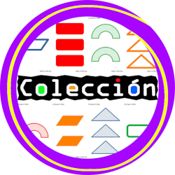
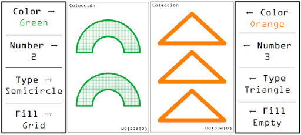
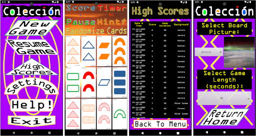

# Colección

  

## **Colección** is a card matching game based on [Set](https://www.setgame.com/set/puzzle), with different (and additional) Shapes, Colors, and Fill Types.

**The goal:** find sets of three cards that fulfill the requirements for a match as rapidly as possible.

---

## Card Properties

- Color: Each card has 1 of 4 possible colors: Blue, Orange, Green, and Red.

- Number: The number of shapes present on the card: 1, 2, or 3.

- Type: There are 4 different kinds of shapes in the game: Triangles, Parallelograms, Semicircles, and 	Rectangles.

- Fill:	Each shape will have 1 of 3 patterns: Solid, Empty, or Grid.

## Examples

---

## Screenshots

---

### Additional information and gameplay overview can be found in the **Help** section of the app.
